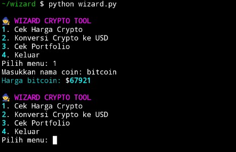

🧙‍♂️ WIZARD – Crypto Utility CLI

Wizard is a Python-based CLI (Command Line Interface) crypto utility built and executed using Termux.

This project helps crypto users to:

✅ Check real-time crypto prices
✅ Convert crypto to USD
✅ Calculate portfolio value
✅ Use a clean and modern terminal interface

📸 Proof of Successful Execution
Below is a screenshot showing the project successfully running inside Termux:

🚀 Main Features

1️⃣ Check Crypto Price

Fetch real-time crypto price data from the CoinGecko API.
Example:
Enter coin name: bitcoin
Bitcoin price: $67921

2️⃣ Convert Crypto to USD

Calculate the USD value of a given amount of cryptocurrency.

3️⃣ Portfolio Checker

Display a simple portfolio table formatted cleanly using the rich library.

🛠️ Technologies Used

Python 3
Requests
Rich (Terminal UI formatting)
CoinGecko Public API
Termux (Android terminal environment)

📦 Installation on Termux

Update and install dependencies:

pkg update && pkg upgrade -y
pkg install python git nano -y
pip install requests rich

Create or clone the project:

mkdir wizard
cd wizard

Run the application:

python wizard.py

📂 Project Structure

wizard/
├── wizard.py
├── wizard
├── screenshot.png
└── README.md

🔌 API Used

Wizard uses the free public API from:

https://api.coingecko.com/api/v3

No API key required.

🧠 How It Works
User selects a menu option
The application sends a request to CoinGecko
Data is processed
Results are displayed in a clean terminal interface using Rich

💰 Trac Address : 
trac1eqavrs2qsuv6zdwmvc3k2nj9vm2l030qhpaescyv87dpkd3d0zvqk468hp
